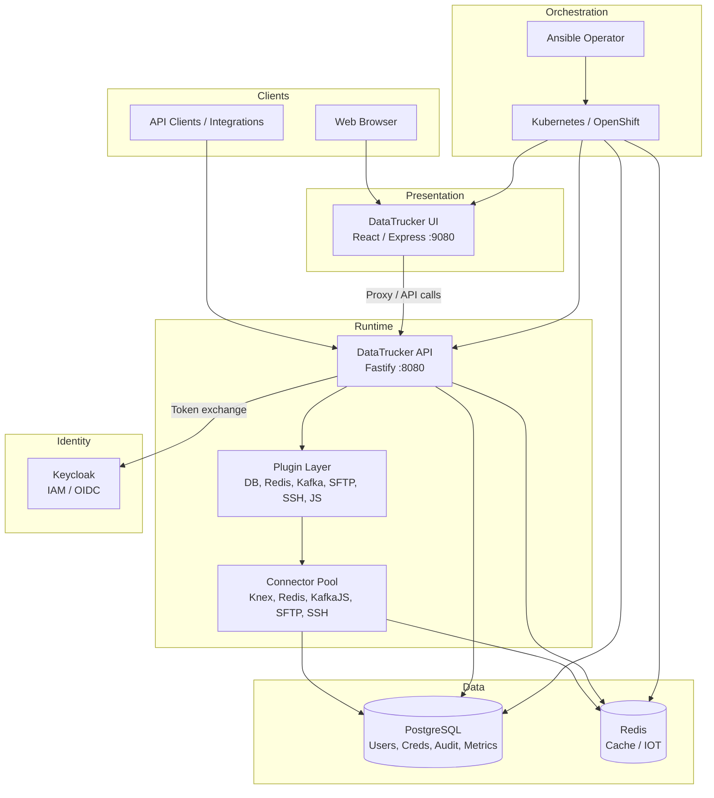

# DataTrucker.IO

**Enterprise low-code API backend platform — define, deploy, and operate REST APIs without traditional controller code.**

[](LICENSE)
[](helm/datatrucker-platform/Chart.yaml)
[](datatrucker_api/)
[](datatrucker_operator/)
[](docs/build/OPENSHIFT_DEPLOYMENT.md)

---

Every new enterprise project starts the same way: scaffold an API framework, wire authentication, configure RBAC, set up database connections, build CRUD endpoints, add audit logging, and deploy infrastructure. Teams spend **60–80% of their initial sprint on plumbing** before writing a single line of business logic.

**DataTrucker.IO eliminates that waste.** Instead of hand-crafting routes and services, teams declare **Job Definitions** — JSON or YAML documents that specify plugin type, validation schema, credentials, and execution logic. The platform runtime resolves these at request time, validates input with AJV, executes the appropriate plugin, and returns a standardized response envelope.

> *Configuration over code. Plugins over boilerplate. Operators over manual deploys.*

---

## Table of Contents

- [Why DataTrucker?](#why-datatrucker)
- [Architecture](#architecture)
- [Key Features](#key-features)
- [Quick Start](#quick-start)
- [Plugin Ecosystem](#plugin-ecosystem)
- [Kubernetes Custom Resources](#kubernetes-custom-resources)
- [Mock Use Cases](#mock-use-cases)
- [Project Structure](#project-structure)
- [Technology Stack](#technology-stack)
- [Documentation](#documentation)
- [Demos](#demos)
- [Contributing](#contributing)
- [License](#license)

---

## Why DataTrucker?

| Traditional API Development | DataTrucker |
|----------------------------|-------------|
| Write controllers and services | Define `JobDefinitions` in YAML/JSON |
| Implement request validation manually | AJV schemas declared alongside jobs |
| Wire auth and RBAC per endpoint | Tenant-scoped RBAC built in |
| Deploy and scale per microservice | Operator-managed lifecycle on K8s/OpenShift |
| Repeat plumbing on every project | Reuse 17 plugin types across domains |

**What you get out of the box:**

- **17 plugin types** — databases, Kafka, Redis, SFTP, SSH, JavaScript, and more
- **Multi-tenant RBAC** — tenant isolation with reader/author roles and JWT session management
- **Zero-trust security** — AES-256 credential encryption, Keycloak OIDC, Helmet hardening, audit redaction
- **Visual workflow builder** — drag-and-drop pipeline canvas that exports to CR-ready JSON
- **Kubernetes Operator** — declarative GitOps for API deployments via Custom Resources
- **8 production-grade mock stories** — deployable reference architectures for HR, CRM, fintech, healthcare, IoT, and more

---

## Architecture



### Four Core Components

| Component | Technology | Role |
|-----------|------------|------|
| **API Server** | Node.js 20 / Fastify 3 | Job execution runtime, plugin host, management APIs |
| **UI Console** | React 17 / Material-UI 4 | Admin portal, visual workflow builder, settings |
| **Operator** | Ansible Operator / Kubernetes | Declarative lifecycle for API deployments on K8s/OpenShift |
| **Infrastructure** | PostgreSQL, Redis, Keycloak | Persistence, caching, enterprise IAM |

### Request Lifecycle

```
Client → JWT Auth → Load Job Definition → AJV Validate → Plugin Execute → Standardized Response
```

Every request flows through authentication, schema validation, and plugin dispatch — with audit logging and credential isolation at every step. See [System Overview](docs/architecture/SYSTEM_OVERVIEW.md) for the full sequence diagram.

---

## Key Features

### Configuration Over Code

API endpoints are not registered in source code. Each endpoint is a job definition stored as a Kubernetes Custom Resource, named by convention:

```
{HTTP_METHOD}-{TENANT}-{jobid}.json
```

Example: `GET-Admin-echoapi.json` defines a GET job named `echoapi` for the `Admin` tenant.

### CR-Driven Deployment

All platform behavior is defined through Kubernetes Custom Resources — no ConfigMap mounts for API configuration. The operator reconciles CRs into Deployments, Services, ConfigMaps, and Secrets.

### Visual Workflow Builder

A node-based pipeline canvas at `/workflow-builder` lets you drag-and-drop job nodes (Input → Transform → Output), connect them to define pipeline flow, and export the result as JSON for `JobDefinitions` in a `DatatruckerFlow` CR.

### Admin Portal

Comprehensive settings UI at `/admin` for environment configuration, RBAC role management, connection health monitoring, and deployment settings (replicas, registry, tags). Light/dark theme with persistent preference.

### Security by Default

- JWT validation on every request (Keycloak OIDC or local RS256)
- Tenant-scoped RBAC with group mappings (`wrt`: 0=reader, 1=author)
- AJV input validation preventing injection attacks
- AES-256-CBC credential encryption at rest (dual-access: DB + filesystem key)
- Audit hooks that redact passwords from logged request bodies
- Helmet middleware with frameguard deny

---

## Quick Start

### Local Development (Docker Compose)

**Prerequisites:** Docker or Podman with Compose, 8 GB RAM minimum.

```bash
git clone https://github.com/datatruckerio/datatrucker.io.git
cd datatrucker.io
docker compose up -d
```

| Service | URL |
|---------|-----|
| API | http://localhost:8080 |
| UI | http://localhost:9080 |
| Keycloak | http://localhost:8081 |
| PostgreSQL | localhost:5432 |
| Redis | localhost:6379 |

Verify the stack:

```bash
curl http://localhost:8080/api/v1/statuschecks/healthcheck
./scripts/run-tests.sh
```

See [Local Setup Guide](docs/build/LOCAL_SETUP.md) for development workflows.

### OpenShift / Kubernetes (5 minutes)

**Prerequisites:** OpenShift 4.x or CRC with `oc` and `helm` installed.

```bash
# Login to cluster
oc login -u developer https://api.crc.testing:6443

# Full deploy: platform + operator + all mock use cases
./cli/datatrucker-cli.sh full-reset

# Check status
./cli/datatrucker-cli.sh status

# Run tests
./cli/datatrucker-cli.sh test
```

**CLI commands:**

```bash
./cli/datatrucker-cli.sh init-admin --admin-user admin --admin-pass secret
./cli/datatrucker-cli.sh create-tenant --tenant-id acme-corp
./cli/datatrucker-cli.sh load-mocks
```

See [Getting Started](docs/build/GETTING_STARTED.md) and [OpenShift Deployment](docs/build/OPENSHIFT_DEPLOYMENT.md) for full details.

### Your First Job Definition

```yaml
apiVersion: datatrucker.datatrucker.io/v1
kind: DatatruckerFlow
metadata:
  name: my-first-flow
spec:
  Type: Job
  Replicas: 1
  DatatruckerConfig: platform-config
  JobDefinitions:
    - name: hello-world
      type: Util-Echo
      tenant: Admin
      restmethod: GET
      validations:
        type: object
        properties: {}
  API:
    Image:
      repository: quay.io/datatrucker
      imageName: datatrucker-api
      tagName: "2.1.0"
```

Apply the CR — the operator reconciles it into a running API endpoint. No controller code required.

---

## Plugin Ecosystem

Every job `type` maps to a Fastify-decorated plugin handler:

| Category | Types | Capability |
|----------|-------|------------|
| **Database** | `DB-Postgres`, `DB-Mysql`, `DB-Mssql`, `DB-Oracle`, `DB-Mariadb`, `DB-Sqllite` | SQL execution via Knex |
| **IoT / Messaging** | `IOT-Redis`, `IOT-Kafka`, `IOT-Proxy` | Redis ops, Kafka produce/consume, HTTP proxy |
| **File** | `File-SFTP` | SFTP file operations |
| **Script** | `Script-JS`, `Script-SSH`, `Script-Shell` | Sandboxed JS, remote SSH, local shell |
| **Utility** | `Util-Echo`, `Util-Fuzzy`, `Util-Sentiment` | Health check, fuzzy match, sentiment analysis |
| **Flow** | `Chain`, `Block` | Multi-step orchestration, conditional/loop blocks |

Full reference with CR examples: [Plugin Types](docs/api/PLUGIN_TYPES.md)

---

## Kubernetes Custom Resources

| CR | Purpose |
|----|---------|
| `DatatruckerConfig` | Platform DB, crypto keys, Keycloak, plugin settings |
| `DatatruckerFlow` | JobDefinitions, replicas, API/UI image selection |
| `DatatruckerInit` | Bootstrap admin user and database initialization |
| `DatatruckerTenant` | Multi-tenant provisioning with roles and isolation |
| `DatatruckerMock` | Deploy mock use cases as pre-built Flow CRs |

**Helm charts:**

| Chart | Path | Description |
|-------|------|-------------|
| Platform | `helm/datatrucker-platform/` | PostgreSQL, Redis, Config + Flow CRs |
| Mocks | `helm/datatrucker-mocks/` | Eight mock use cases as `DatatruckerMock` CRs |

**Container images** (Quay.io):

```
quay.io/datatrucker/datatrucker-api:2.1.0
quay.io/datatrucker/datatrucker-ui:2.1.0
quay.io/datatrucker/datatrucker-operator:2.1.0
quay.io/datatrucker/datatrucker-operator-bundle:2.1.0
```

---

## Mock Use Cases

Eight complete, deployable business scenarios — each with a narrative **STORY.md** for newcomers. Start here if you are new to DataTrucker.

| Story | Folder | In one sentence |
|-------|--------|-----------------|
| The HR team that outgrew spreadsheets | [employee-management](mocks/employee-management/STORY.md) | Departments, roles, and approvals without a bespoke HR app |
| Sales that never wants to miss a lead | [crm-pipeline](mocks/crm-pipeline/STORY.md) | Leads, webhooks, and pipeline stages wired to Kafka |
| Democracy on a deadline | [voter-registration-system](mocks/voter-registration-system/STORY.md) | Citizen registration with eligibility checks and audit trail |
| Shops with more than one warehouse | [ecommerce-inventory-sync](mocks/ecommerce-inventory-sync/STORY.md) | Stock moves safely across warehouses with locking |
| Machines that talk before people notice | [iot-telemetry-alerts](mocks/iot-telemetry-alerts/STORY.md) | Device telemetry, thresholds, and alert fan-out |
| Banks that must know you before they trust you | [fintech-kyc-onboarding](mocks/fintech-kyc-onboarding/STORY.md) | Step-by-step KYC with identity checks |
| Care without compromising privacy | [healthcare-patient-portal](mocks/healthcare-patient-portal/STORY.md) | Patient-facing flows with sensitive data handled carefully |
| SaaS that spins up a customer in minutes | [saas-tenant-provisioning](mocks/saas-tenant-provisioning/STORY.md) | New tenant namespace, config, and default API in one flow |

```bash
# Deploy all mocks on OpenShift
./cli/datatrucker-cli.sh load-mocks

# Or run a single story locally
docker compose \
  -f docker-compose.yml \
  -f mocks/employee-management/configs/docker-compose.override.yml \
  up -d --build
```

See [Mock Story Collection](mocks/README.md) for the full guide.

---

## Project Structure

```
datatrucker.io/
├── datatrucker_api/          # Fastify API server (plugins, connectors, services)
├── datatrucker_ui/           # React admin console + Express proxy
├── datatrucker_operator/     # Ansible Operator (CRDs, roles, bundle)
├── helm/
│   ├── datatrucker-platform/ # Platform Helm chart
│   └── datatrucker-mocks/    # Mock use case Helm chart
├── mocks/                    # 8 deployable business scenario stories
├── cli/                      # datatrucker-cli.sh — CR-driven management
├── docs/                     # Architecture, API, build, and technical docs
├── articles/                 # Blog posts and design narratives
├── scripts/                  # Build, deploy, and test automation
├── ci/                       # Postman collections for Newman tests
└── docker-compose.yml        # Local full stack
```

---

## Technology Stack

| Layer | Technology | Version |
|-------|------------|---------|
| Runtime | Node.js | 20 |
| API Framework | Fastify | 3.20+ |
| ORM / Query | Knex | 0.95+ |
| Validation | AJV | 8.6+ |
| Auth | fastify-jwt (RS256) | 3.0+ |
| IAM | Keycloak | 24.0 |
| Database | PostgreSQL | 16 |
| Cache | Redis | 7 |
| UI Framework | React + Material-UI | 17 / 4.12 |
| UI Server | Express | 4.17+ |
| Operator | Ansible Operator SDK | community.kubernetes |
| Container Registry | Quay.io | datatrucker/* |
| CI/CD | GitHub Actions | — |

---

## Documentation

### Getting Started

| Guide | Description |
|-------|-------------|
| [Getting Started](docs/build/GETTING_STARTED.md) | CR-driven deployment on OpenShift |
| [Local Setup](docs/build/LOCAL_SETUP.md) | Docker Compose development environment |
| [CLI Reference](docs/build/CLI.md) | `datatrucker-cli.sh` commands |
| [Full Reset Guide](docs/build/FULL_RESET.md) | Clean redeploy workflow |
| [Configuration](docs/build/CONFIGURATION.md) | Platform configuration reference |
| [OpenShift Deployment](docs/build/OPENSHIFT_DEPLOYMENT.md) | Production deployment guide |

### Architecture & Technical

| Guide | Description |
|-------|-------------|
| [System Overview](docs/architecture/SYSTEM_OVERVIEW.md) | Full architecture and design principles |
| [Component Interaction](docs/architecture/COMPONENT_INTERACTION.md) | Inter-service communication |
| [Data Flow Pipelines](docs/technical/DATA_FLOW_PIPELINES.md) | Chain and Block orchestration |
| [Security](docs/technical/SECURITY.md) | Threat model and hardening |
| [Plugin Development](docs/technical/PLUGIN_DEVELOPMENT.md) | Building custom plugins |
| [Database Schema](docs/technical/DATABASE_SCHEMA.md) | PostgreSQL table reference |

### API Reference

| Guide | Description |
|-------|-------------|
| [Plugin Types](docs/api/PLUGIN_TYPES.md) | All 17 plugin types with CR examples |
| [Jobs API](docs/api/JOBS_API.md) | Job execution endpoints |
| [Authentication](docs/api/AUTHENTICATION.md) | JWT, Keycloak, and session management |
| [OpenAPI Overview](docs/api/OPENAPI_OVERVIEW.md) | REST API surface |

### Articles

| Article | Topic |
|---------|-------|
| [The Low-Code Paradigm Shift](articles/architecture-low-code-paradigm.md) | Why configuration beats boilerplate |
| [Kubernetes Operator Journey](articles/kubernetes-operator-journey.md) | From manual deploys to GitOps |
| [Enterprise Performance Gains](articles/enterprise-performance-gains.md) | Real-world impact metrics |

---

## Demos

**5-minute platform walkthrough:**

[](https://www.youtube.com/watch?v=OKu4YNZhPwg)

**Kubernetes Operator deployment:**

[](https://youtu.be/DKLFDqhjs5M)

---

## Contributing

We welcome contributions! Please read [CONTRIBUTE.md](CONTRIBUTE.md) for:

- Local development environment setup (minikube, Docker, Node.js)
- Gitflow branching strategy (`develop` → `main`)
- Code review and merge process

**Quick contribution path:**

1. Fork the repository and create a feature branch from `develop`
2. Make your changes with tests where applicable
3. Run `./scripts/run-tests.sh` locally
4. Open a pull request against `develop`

---

## License

DataTrucker.IO is licensed under the [Apache License 2.0](LICENSE).

---

<p align="center">
  <strong>DataTrucker.IO</strong> — Ship APIs, not boilerplate.<br/>
  Built by <a href="https://github.com/gauravshankarcan">Gaurav Shankar</a>
</p>
