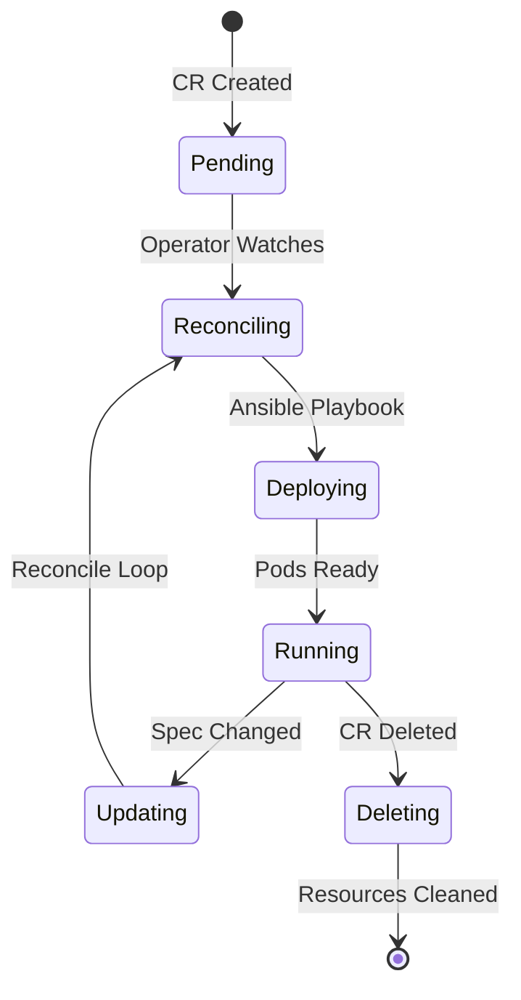

# From Manual Deployments to Operator-Driven Lifecycle: The DataTrucker Kubernetes Journey

*By Gaurav Shankar — Principal Software Engineer, DataTrucker.IO*

## The Challenge

Deploying DataTrucker manually on Kubernetes required:

1. Creating ConfigMaps for server, database, and crypto configs
2. Deploying PostgreSQL, Redis, and Keycloak separately
3. Building and pushing API and UI container images
4. Creating Services, Routes, and RBAC policies
5. Repeating all of this for every environment

This process took 2–4 hours per environment and was error-prone.

## The Operator Solution

DataTrucker ships an Ansible-based Kubernetes Operator that manages two Custom Resources:

### DatatruckerConfig

Defines platform configuration — crypto keys, database connections, Keycloak integration, plugin enablement.

```yaml
apiVersion: datatrucker.datatrucker.io/v1
kind: DatatruckerConfig
metadata:
  name: datatruckerconfig-sample
spec:
  API:
    crypto:
      JWT:
        signOptions:
          algorithm: RS256
          expiresIn: 60m
```

### DatatruckerFlow

Defines API flows — job definitions, resource limits, replica counts, container images.

```yaml
apiVersion: datatrucker.datatrucker.io/v1
kind: DatatruckerFlow
metadata:
  name: my-api-flow
spec:
  JobDefinitions:
    - name: healthcheck
      type: Util-Echo
      tenant: Admin
      restmethod: GET
  Replicas: 2
  DatatruckerConfig: datatruckerconfig-sample
```

## Operator Lifecycle



## What the Operator Manages

| Resource | Purpose |
|----------|---------|
| Deployment | API and UI pods |
| Service | Internal networking |
| Route | OpenShift external access |
| ConfigMap | Job definitions, scripts, keys |
| Secret | Encrypted credentials |

## Operator Hub Distribution

DataTrucker is published on OperatorHub.io with versions tracked in the community-operators repository. Version 2.1.0 introduces:

- Quay.io image registry (`quay.io/datatrucker/*`)
- Updated Ansible Operator base image
- Performance-optimized resource defaults
- Enhanced security hardening

## Installation

```bash
# Via OperatorHub on OpenShift
oc apply -f datatrucker-operator/subscription.yaml

# Or direct install
oc apply -f datatrucker_operator/config/crd/
oc apply -f datatrucker_operator/config/rbac/
oc apply -f datatrucker_operator/config/manager/
```

## CI/CD Integration

The GitHub Actions pipeline automatically:

1. Builds and tests the platform
2. Pushes images to `quay.io/datatrucker`
3. Validates mock use case structure
4. Prepares Operator Hub bundle updates

## Lessons Learned

1. **Ansible operators** are ideal for configuration-heavy platforms like DataTrucker
2. **Separate Config and Flow CRs** provide clean separation of platform vs. application config
3. **AllNamespaces install mode** simplifies multi-team adoption
4. **Automated bundle generation** via `operator-sdk generate bundle` keeps Operator Hub in sync

## Conclusion

The operator transforms DataTrucker from a manual deployment exercise into a one-command platform installation. Teams can focus on defining business logic in YAML while the operator handles the entire infrastructure lifecycle.

---

*Gaurav Shankar is the builder of DataTrucker.IO. Connect on LinkedIn or email gauravshankar.can@gmail.com.*
