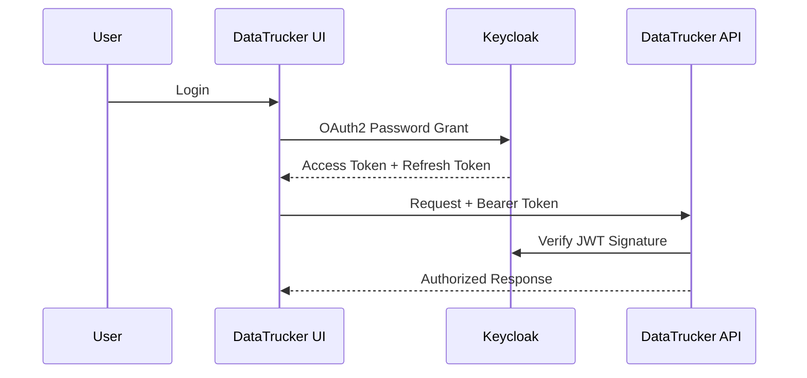

# Authentication Guide

## Keycloak Integration

DataTrucker integrates with Keycloak for enterprise IAM:

1. Configure realm in `crypto.config.json`
2. Set `keycloak: true` in `server.config.json`
3. Import realm JSON from `deploy/keycloak/realm-export.json`

## Token Flow

## Local JWT (Development)

For local development without Keycloak, use local RS256 keys in `app/config/`.

## Builder

Gaurav Shankar
