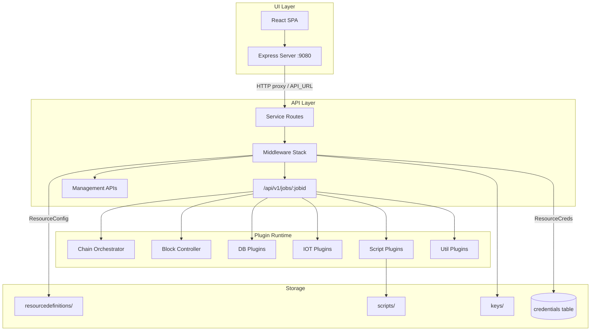
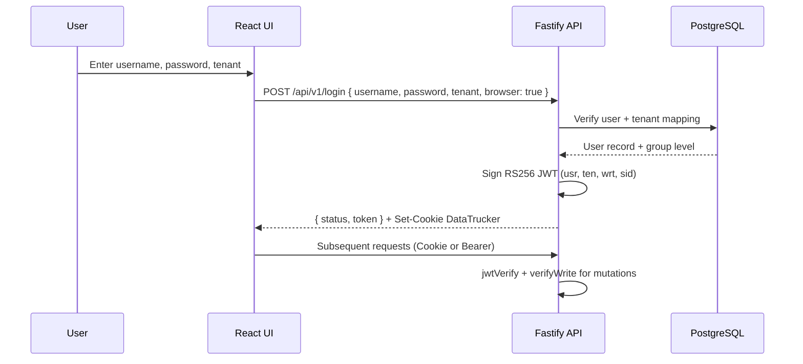
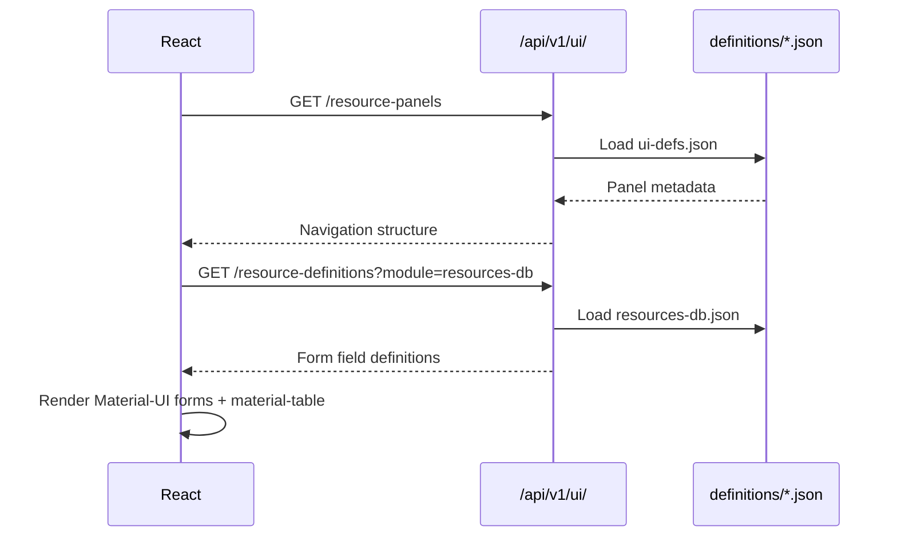
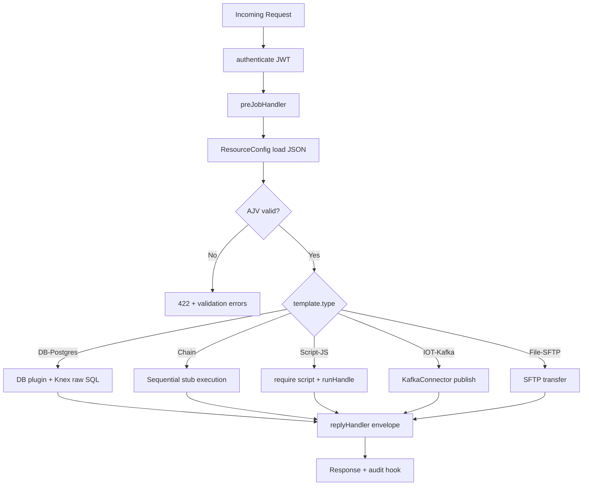
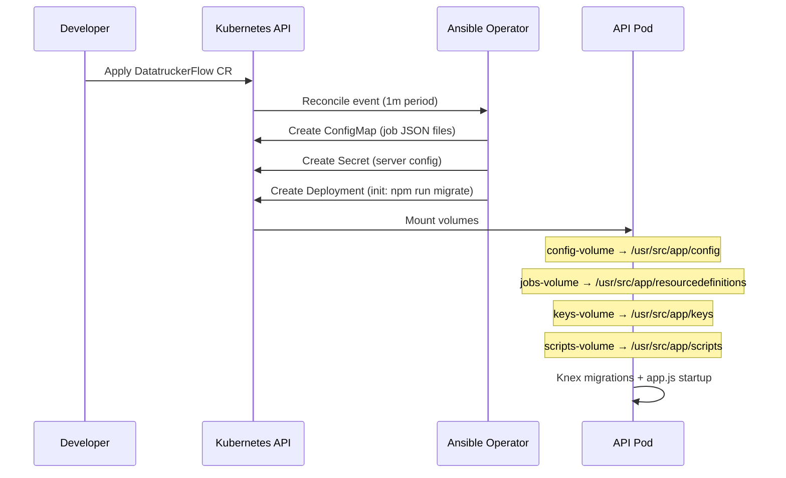
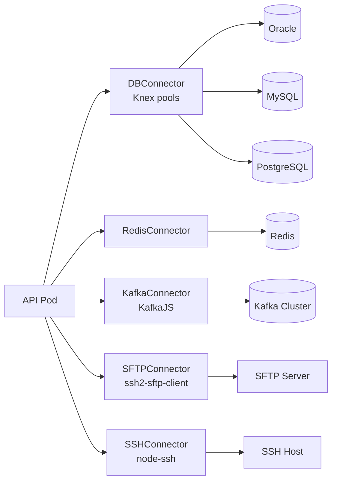

# Component Interaction

This document describes how the DataTrucker API, UI, Ansible Operator, and plugin layer interact at runtime and during deployment.

## Runtime Interaction Map



## API ↔ UI Interaction

The UI is a React single-page application served by an Express server (`datatrucker_ui/app/server.js`). In production containers, the UI receives `API_URL` (or `REACT_APP_APIURL`) pointing to the API service.

### Authentication Flow



The UI management console calls management endpoints:

| UI Feature | API Endpoint | Auth |
|------------|--------------|------|
| Resource definitions | `GET/POST/DELETE /api/v1/resources` | JWT + verifyWrite |
| Credentials | `GET/POST/PUT/DELETE /api/v1/credentials` | JWT + verifyWrite |
| Users | `GET/POST/PUT/DELETE /api/v1/users` | JWT + verifyAdmin + verifyWrite |
| Groups | `GET/POST/PUT/DELETE /api/v1/groups` | JWT + verifyAdmin + verifyWrite |
| Audit logs | `GET /api/v1/ui/auditlogs` | JWT + verifyWrite |
| Job metrics | `GET /api/v1/ui/jobdata` | JWT + verifyWrite |
| Panel definitions | `GET /api/v1/ui/resource-panels` | JWT + verifyWrite |
| Cache flush | `POST /api/v1/cache/` | JWT + verifyAdmin + verifyWrite |

UI definitions are driven by JSON schemas in `datatrucker_api/app/services/ui/definitions/` (e.g., `resources-db.json`, `credentials.json`, `chains.json`), which the API serves to dynamically build Material-UI forms.

### UI Definition Loading



## API ↔ Plugin Interaction

### Job Execution Pipeline

When a client calls `ANY /api/v1/jobs/{jobid}`:

1. **`preJobHandler`** merges query params (GET/DELETE) or body (POST/PUT) into `request.datacontent`.
2. **`ResourceConfig`** reads `resourcedefinitions/{METHOD}-{tenant}-{jobid}.json`.
3. **`ajvHandler`** compiles and runs the job's `validations` JSON Schema.
4. **`f[request.template.type](request, reply)`** dispatches to the decorated plugin handler.
5. **`replyHandler`** wraps the result in the standard envelope.



### Chain Plugin Orchestration

The `Chain` plugin executes multiple job stubs sequentially, with JSONPath-based data passing:

```json
{
  "type": "Chain",
  "chain": [
    {
      "stub": "fetch-user",
      "method": "GET",
      "register": "userData",
      "datacontent": { "userId": "$request|$.body.id" }
    },
    {
      "stub": "update-record",
      "method": "POST",
      "datacontent": { "name": "$userData|$.rows[0].name" }
    }
  ]
}
```

`$request` references the original request cache; `$userData` references output registered from a prior step.

### Block Plugin Conditionals

The `Block` plugin supports `when` conditions and `loop` iterations, delegating to linked resource definitions via `resourcelink` and `resourcelinkedmethod`.

## API ↔ Operator Interaction

The Ansible Operator watches two custom resources:

| CRD | API Group | Reconcile Role |
|-----|-----------|----------------|
| `DatatruckerConfig` | `datatrucker.datatrucker.io/v1` | Temp DB, server config Secrets |
| `DatatruckerFlow` | `datatrucker.datatrucker.io/v1` | API Deployment, UI Deployment, job ConfigMaps |



### DatatruckerFlow Types

The `Type` field in the CR spec determines deployment mode:

| Type | Config Secret | UI Deployed |
|------|---------------|-------------|
| `Job` | `{DatatruckerConfig}-jobs-config` | No |
| `Management` | `{DatatruckerConfig}-management-config` | Yes |
| `Login` | `{DatatruckerConfig}-login-config` | No |

`JobDefinitions` in the CR are transformed into ConfigMap data keys:

```
{restmethod}-{tenant}-{name}.json
```

This matches the filename convention expected by `ResourceConfig`.

### Volume Mount Contract

| Volume | Mount Path | Source |
|--------|------------|--------|
| `config-volume` | `/usr/src/app/config` | Secret (`serverconfigmap`) |
| `jobs-volume` | `/usr/src/app/resourcedefinitions` | ConfigMap (`{name}-job`) |
| `keys-volume` | `/usr/src/app/keys` | ConfigMap (`Keys.configmap`) |
| `scripts-volume` | `/usr/src/app/scripts` | ConfigMap (`Scripts.configmap`) |

## API ↔ External Systems

Plugins interact with external systems through connector pools:



Credentials for external connections are tenant-scoped rows in the `credentials` table, decrypted at runtime via `f.decrypt()`.

## Middleware Stack Order

Registration order in `app.js` determines execution:

| Order | Middleware | Responsibility |
|-------|------------|----------------|
| 1 | `db` | Knex connection to platform PostgreSQL |
| 2 | `metrics` | Job/login metric counters |
| 3 | `cache` | ResourceConfig, ResourceCreds, AJV caches |
| 4 | `jwt` | RS256 sign/verify, authenticate decorator |
| 5 | `auth` | Password hash, AES encrypt/decrypt, Keycloak |
| 6 | `support` | JSON template substitution helpers |
| 7 | `hooks` | Audit logging, replyHandler, ajvHandler |

Global plugins (Helmet, Compress, Cookie, Sensible) register before middleware.

## Error Propagation

| Layer | Error Code | Behavior |
|-------|------------|----------|
| JWT invalid | 401 | `{ status: false }` |
| AJV validation fail | 422 | `reqCompleted: false`, AJV errors in `errorMsg` |
| Plugin execution fail | 422 | `reqCompleted: false`, error message (if `jobResponseErrors: true`) |
| Management API fail | 422 | Standard error envelope |
| Write denied | 401 | `Read Access Only permitted` |

## Cache Coherence

When resource definitions or credentials change via the management API, operators or admins should call:

```
POST /api/v1/cache/
```

This flushes `ResourceConfig`, `ResourceCreds`, `CredHandle`, and `AJVHandle` caches. The operator's rolling deployment also ensures new ConfigMap versions reach pods.

## Related Documentation

- [System Overview](./SYSTEM_OVERVIEW.md)
- [State Machines](./STATE_MACHINES.md)
- [Data Flow Pipelines](../technical/DATA_FLOW_PIPELINES.md)
- [OpenShift Deployment](../build/OPENSHIFT_DEPLOYMENT.md)
