# State Machines

DataTrucker.IO implements several implicit state machines governing platform initialization, job execution, deployment lifecycle, and user authorization. This document formalizes those states and transitions.

## Platform Initialization State Machine

Before any authenticated operation, the platform must be initialized with an admin user.

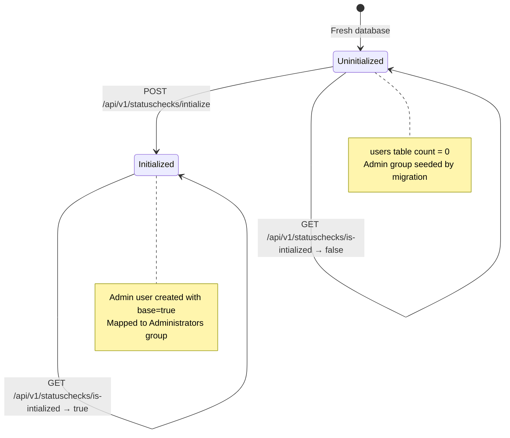

### States

| State | Condition | Available Operations |
|-------|-----------|---------------------|
| **Uninitialized** | `users` table has zero rows | Health check, initialize endpoint only |
| **Initialized** | At least one user exists | Full API surface (subject to auth) |

### Initialization Sequence

1. Knex migrations run (`npm run migrate`) creating tables and seeding the `Administrators` group (`Tenant_Author`, tenant `Admin`).
2. `POST /api/v1/statuschecks/intialize` with `{ username, password }` creates the admin user with salted hash and maps to the Administrators group.
3. `GET /api/v1/statuschecks/healthcheck` returns `dbinitialized: true` once users exist.

## Job Request State Machine

Every job request traverses a deterministic execution pipeline.

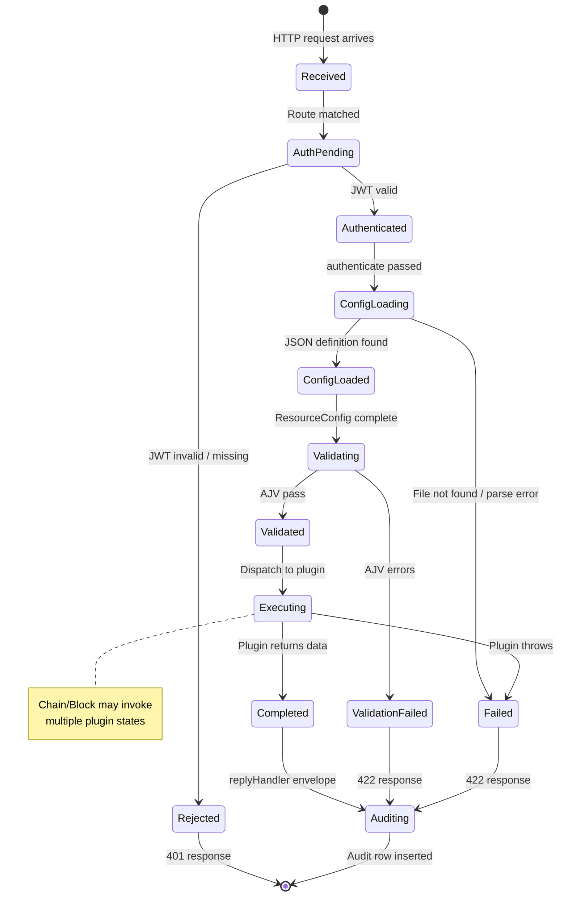

### Job Response Envelope States

| Field | Success | Failure |
|-------|---------|---------|
| `reqCompleted` | `true` | `false` |
| `data` | Plugin result | — |
| `errorMsg` | — | Error details (if enabled) |
| `reqID` | Request ID | Request ID |
| `date` | ISO timestamp | ISO timestamp |
| `serverID` | From server.config | From server.config |

## Chain Execution State Machine

Chain jobs maintain an internal execution state across stubs.

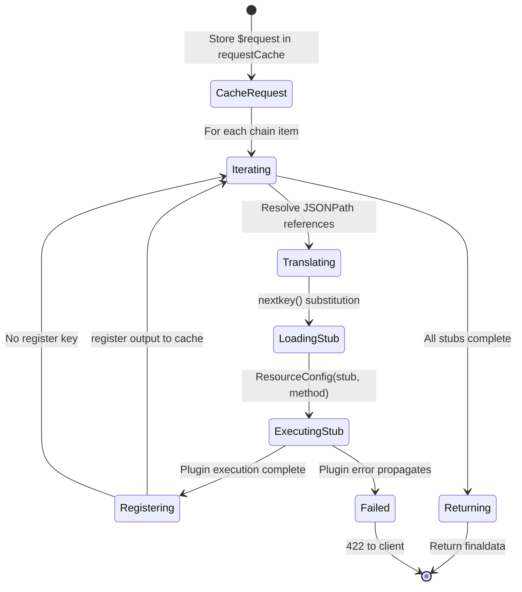

### Request Cache TTL

The `requestCache` uses `server.fastify.requestTimeout` as TTL (configured as 1 second in default `server.config.json`). Chain steps must complete within this window for cross-step references to remain valid.

## Block Execution State Machine

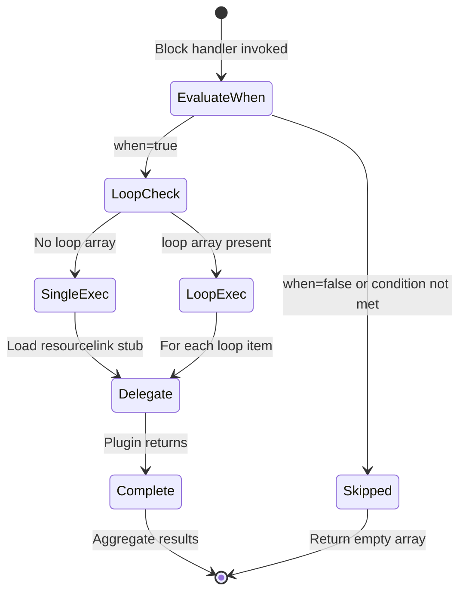

## User Authorization State Machine

JWT payload `wrt` field encodes write permission derived from group level at login time.

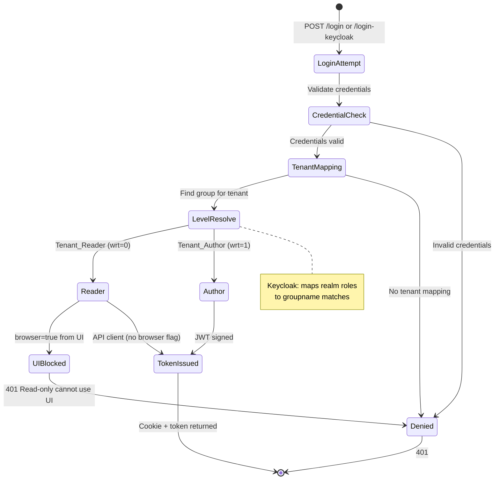

### Admin Tenant Gate

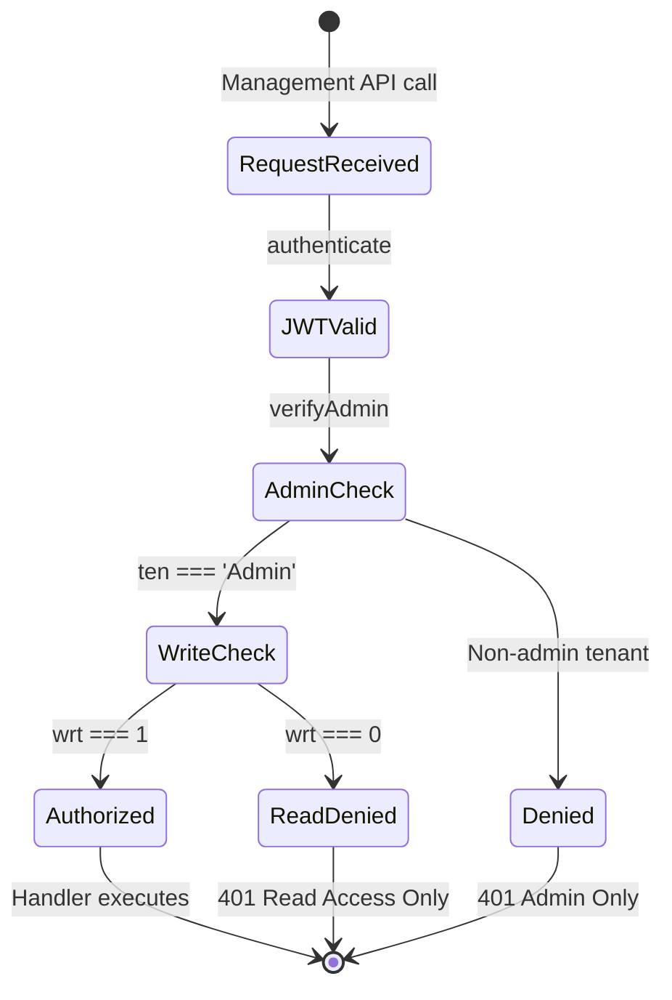

## Deployment Lifecycle State Machine (Operator)

The Ansible Operator reconciles `DatatruckerFlow` resources on a 1-minute period.

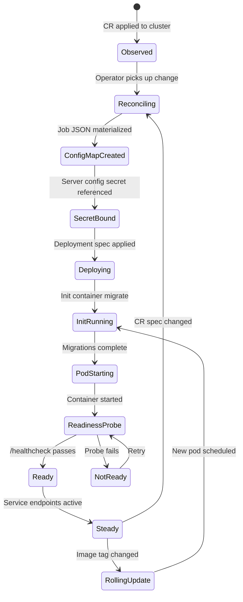

### Deployment Strategy

Operator applies `RollingUpdate` with:
- `maxUnavailable: 1`
- `maxSurge: 1`
- `terminationGracePeriodSeconds: 62`

### Type-Specific Deployment Paths

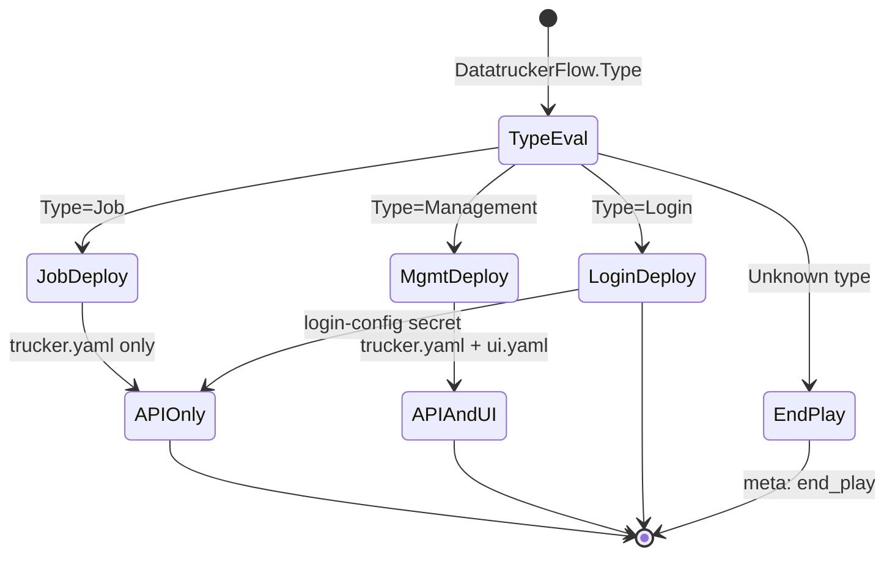

## Credential Lifecycle State Machine

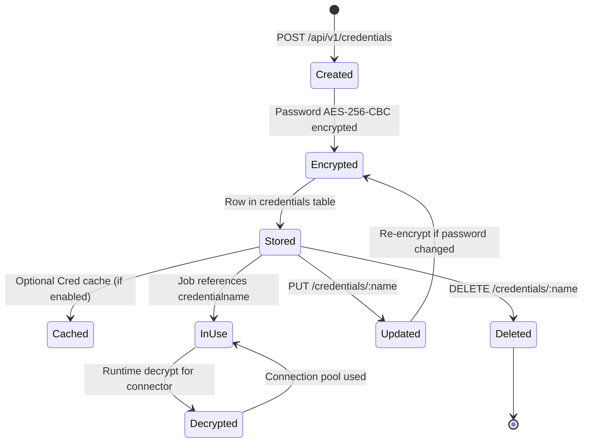

## Audit Event State Machine

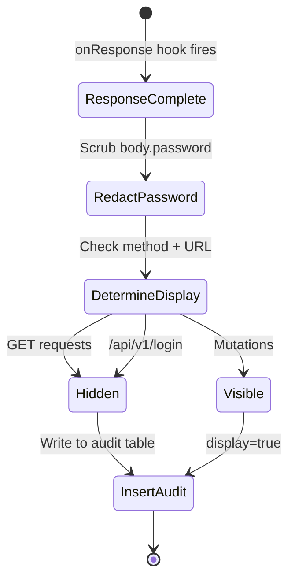

Audit records index on `date`, `api`, `tenant`, and `hourminute` for dashboard queries via `/api/v1/ui/auditlogs`.

## Health Check State Machine

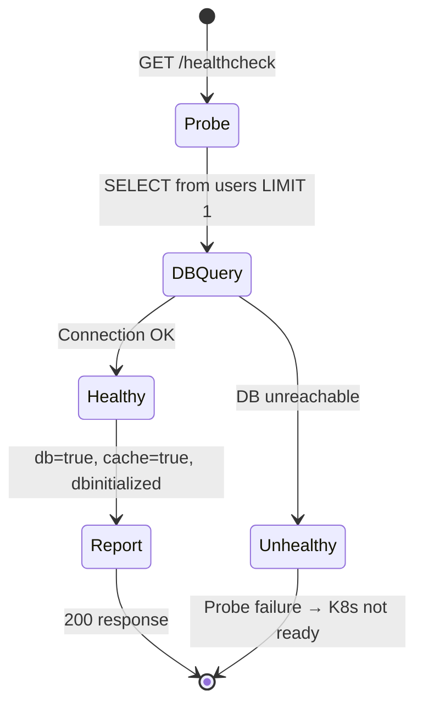

## Related Documentation

- [Component Interaction](./COMPONENT_INTERACTION.md)
- [Jobs API](../api/JOBS_API.md)
- [OpenShift Deployment](../build/OPENSHIFT_DEPLOYMENT.md)
