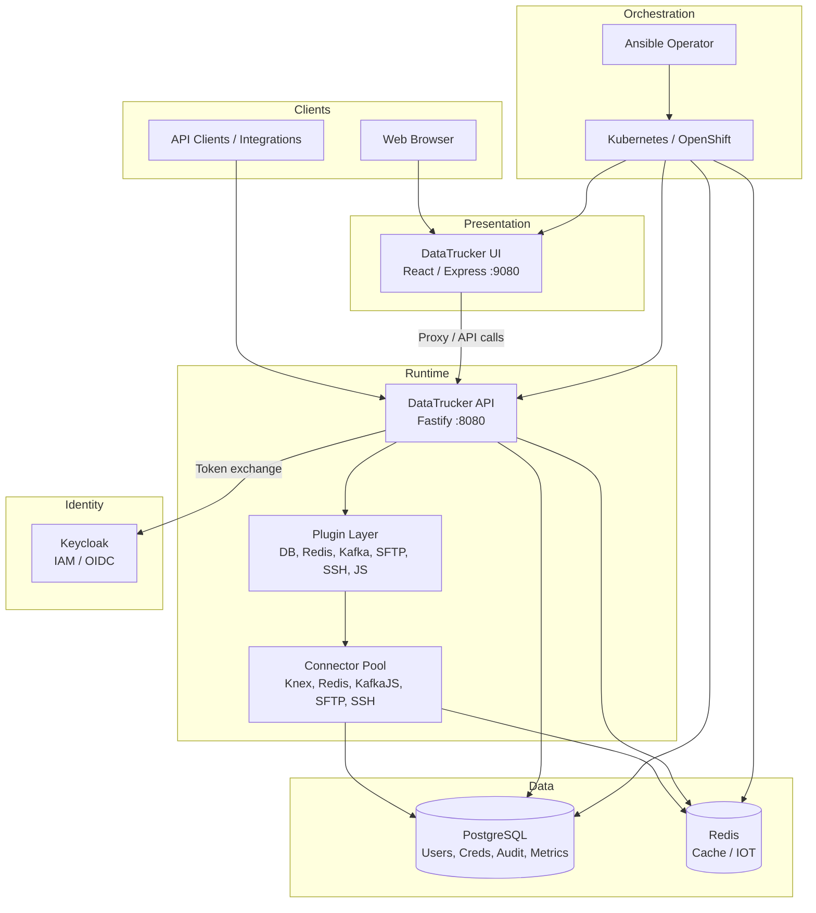
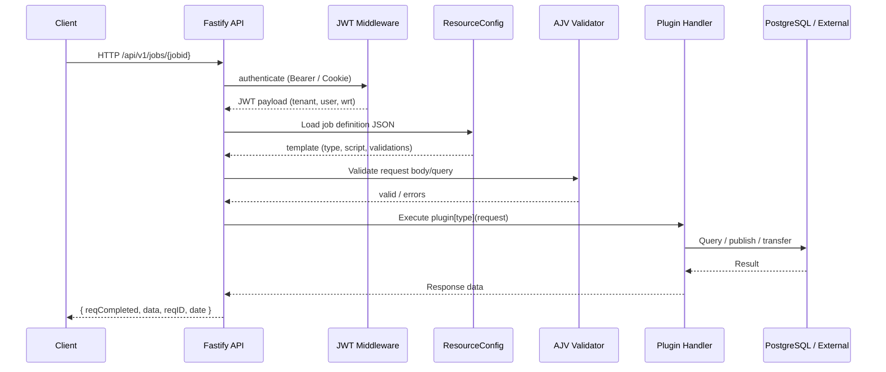
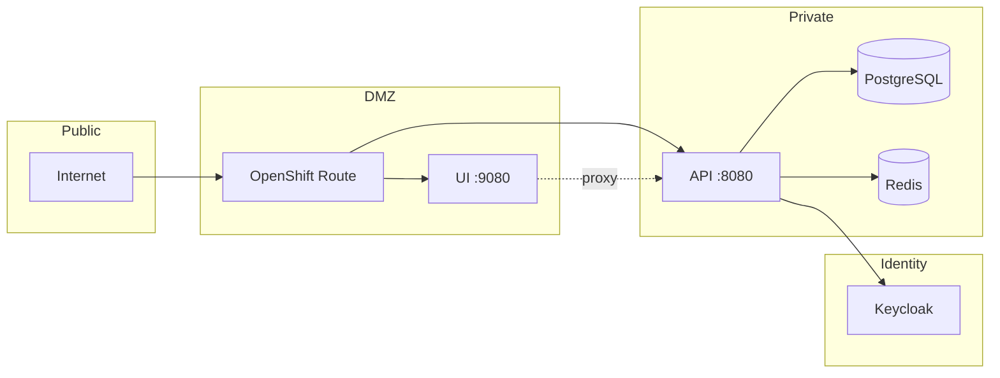

# DataTrucker.IO System Overview

**Version:** 2.1.0  
Gaurav Shankar  
**License:** Apache 2.0

## Executive Summary

DataTrucker.IO is an enterprise low-code API backend platform that lets organizations define, deploy, and operate REST APIs without writing traditional controller code. Instead of hand-crafting routes and business logic in application frameworks, teams declare **Job Definitions**—JSON documents that specify plugin type, validation schema, credentials, and execution script. The platform runtime resolves these definitions at request time, validates input with AJV, executes the appropriate plugin (database query, Kafka publish, SFTP transfer, JavaScript script, etc.), and returns a standardized response envelope.

The platform comprises four primary deployable components:

| Component | Technology | Role |
|-----------|------------|------|
| **API Server** | Node.js 20 / Fastify 3 | Job execution runtime, plugin host, management APIs |
| **UI** | React 17 / Material-UI 4 | Admin console for resources, credentials, users, audit |
| **Operator** | Ansible Operator / Kubernetes | Declarative lifecycle for API deployments on K8s/OpenShift |
| **Infrastructure** | PostgreSQL, Redis, Keycloak | Persistence, caching, enterprise IAM |

## High-Level Architecture



## Core Design Principles

### 1. Configuration Over Code

API endpoints are not registered in source code. Each endpoint is a JSON file stored in `resourcedefinitions/`, named by convention:

```
{HTTP_METHOD}-{TENANT}-{jobid}.json
```

Example: `GET-Admin-echoapi.json` defines a GET job named `echoapi` for the `Admin` tenant. The operator materializes these definitions as Kubernetes ConfigMaps and mounts them into API pods.

### 2. Plugin-Based Execution

Every job definition includes a `type` field that maps directly to a Fastify-decorated handler:

| Type | Capability |
|------|------------|
| `DB-Postgres`, `DB-Mysql`, `DB-Mssql`, `DB-Oracle`, `DB-Mariadb`, `DB-Sqllite` | SQL execution via Knex |
| `IOT-Redis` | Redis read/write operations |
| `IOT-Kafka` | Kafka produce/consume |
| `IOT-Proxy` | HTTP proxy forwarding |
| `File-SFTP` | SFTP file operations |
| `Script-SSH` | Remote SSH command execution |
| `Script-Shell` | Local shell script execution |
| `Script-JS` | Sandboxed Node.js script execution |
| `Util-Echo` | Echo/health-check utility |
| `Util-Fuzzy` | Fuzzy string matching |
| `Util-Sentiment` | Sentiment analysis |
| `Chain` | Multi-step job orchestration |
| `Block` | Conditional/loop execution blocks |

### 3. Multi-Tenant RBAC

Tenants isolate job definitions, credentials, and access control. Users authenticate against a tenant context. JWT payloads carry `ten` (tenant), `usr` (username), `wrt` (write permission: 0=reader, 1=author), and `sid` (session ID). The `Admin` tenant has elevated privileges for user/group management.

### 4. Zero-Trust Credential Handling

Database passwords and connection secrets are AES-256-CBC encrypted at rest in PostgreSQL. Decryption keys live on the API server filesystem (`crypto.config.json`), requiring dual access (DB + filesystem) to recover plaintext credentials. User login passwords use salted SHA-256 HMAC hashing (non-reversible).

### 5. Operator-Driven Deployment

The Ansible-based Kubernetes operator watches custom resources (`DatatruckerFlow`, `DatatruckerConfig`) and reconciles Deployments, Services, ConfigMaps, and Secrets. This enables GitOps-style API lifecycle: change a YAML manifest, the operator rolls out new job definitions without manual pod intervention.

## Request Lifecycle



## Component Directory Structure

```
datatrucker.io/
├── datatrucker_api/          # Fastify API server
│   └── app/
│       ├── app.js            # Bootstrap: middleware, plugins, routes
│       ├── config/           # server, db, crypto, resource configs
│       ├── connectors/       # Connection pool managers
│       ├── plugins/          # Job execution handlers
│       ├── services/         # REST management endpoints
│       ├── middleware/       # JWT, auth, cache, hooks, metrics
│       └── migrations/       # Knex PostgreSQL migrations
├── datatrucker_ui/           # React admin console
│   └── app/
│       ├── src/              # React components
│       └── server.js         # Express static + proxy server
├── datatrucker_operator/     # Ansible Operator
│   ├── roles/
│   │   ├── datatruckerflow/  # API + UI deployment
│   │   └── datatruckerconfig/# ConfigMaps, temp DB
│   ├── config/               # CRD samples, RBAC, scorecard
│   └── watches.yaml          # Operator watch configuration
├── deploy/                   # Keycloak realm export
├── docker-compose.yml        # Local full stack
├── scripts/                  # Build, deploy, test scripts
└── ci/                       # Postman collections for Newman tests
```

## Technology Stack

| Layer | Technology | Version |
|-------|------------|---------|
| Runtime | Node.js | 20 |
| API Framework | Fastify | 3.20+ |
| ORM / Query | Knex | 0.95+ |
| Validation | AJV | 8.6+ |
| Auth | fastify-jwt (RS256) | 3.0+ |
| IAM | Keycloak | 24.0 |
| Database | PostgreSQL | 16 |
| Cache | Redis | 7 |
| UI Framework | React + Material-UI | 17 / 4.12 |
| UI Server | Express | 4.17+ |
| Operator | Ansible Operator SDK | community.kubernetes |
| Container Registry | Quay.io | datatrucker/* |
| CI/CD | GitHub Actions | — |

## Deployment Models

### Local Development

`docker-compose.yml` orchestrates PostgreSQL, Redis, Keycloak, API, and UI on a single bridge network (`datatrucker-net`). Ports: API `8080`, UI `9080`, Keycloak `8081`, PostgreSQL `5432`, Redis `6379`.

### Kubernetes / OpenShift

Two paths:

1. **Manual/scripted:** `scripts/deploy-openshift.sh` applies Deployments, Services, and Routes via `oc apply`.
2. **Operator-driven:** Apply `DatatruckerFlow` and `DatatruckerConfig` CRs; the Ansible operator reconciles full stack including init-container migrations.

### CI/CD

GitHub Actions on `main`/`develop` runs lint, UI build, Newman API tests, then builds and pushes images to `quay.io/datatrucker/*` at version `2.1.0`.

## Scalability Considerations

- **Horizontal scaling:** API pods are stateless; job definitions and keys mount from ConfigMaps/Secrets. Redis request cache is per-pod (short TTL).
- **Connection pooling:** Knex pools configured per credential (`minpool`/`maxpool` in credentials table).
- **Plugin isolation:** Each plugin type is independently enableable via `server.config.json` `pluginsEnable` flags.
- **Rolling updates:** Operator uses `RollingUpdate` with `maxUnavailable: 1`, `maxSurge: 1`.

## Security Boundaries



- API never exposes raw credentials in responses.
- Audit hook redacts passwords from logged request bodies.
- Helmet middleware enforces frameguard deny.
- JWT cookies are `httpOnly` and `sameSite`.

## Related Documentation

- [Component Interaction](./COMPONENT_INTERACTION.md)
- [State Machines](./STATE_MACHINES.md)
- [Local Setup](../build/LOCAL_SETUP.md)
- [Plugin Development](../technical/PLUGIN_DEVELOPMENT.md)
- [Security](../technical/SECURITY.md)
