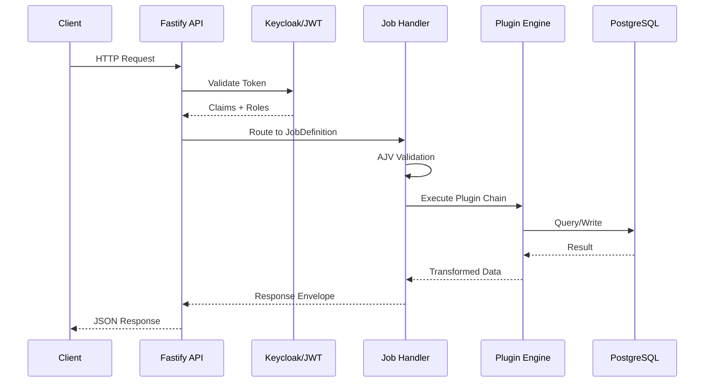

# Data Flow Pipelines

## Request Lifecycle

## Plugin Pipeline Types

| Plugin | Purpose |
|--------|---------|
| Util-Echo | Health checks, passthrough |
| DB | Database queries (PostgreSQL, MySQL, Oracle, MSSQL) |
| IOT-Redis | Redis pub/sub, caching, locking |
| IOT-Kafka | Event streaming |
| Script-JS | Custom JavaScript business logic |
| File-SFTP | File transfer operations |
| Script-SSH | Remote command execution |

## Builder

Gaurav Shankar <gauravshankar.can@gmail.com>
