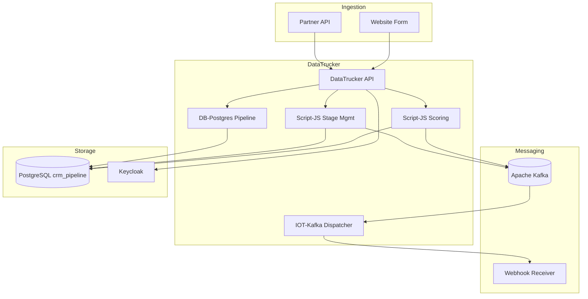

# CRM Pipeline — Architecture

## Overview

The CRM Pipeline mock models a B2B sales automation platform on DataTrucker. It ingests leads, applies algorithmic scoring, manages pipeline stage transitions, and dispatches signed webhook notifications to external systems via Kafka.

## Data Flow



## Lead Scoring Algorithm

Score is computed on a 0–100 scale from weighted signals:

| Signal | Weight | Condition |
|--------|--------|-----------|
| Company size ≥ 500 | +20 | `metadata.company_size` |
| Budget confirmed | +25 | `metadata.budget_confirmed = true` |
| Enterprise industry | +15 | industry in `[finance, healthcare, government]` |
| Referral source | +20 | `source = referral` |
| Trade show | +10 | `source = trade_show` |
| Demo requested | +30 | scoring signal |
| Decision maker identified | +20 | scoring signal |

**Stage auto-assignment on ingest:**
- Score ≥ 70 → `qualified`
- Score 40–69 → `nurturing`
- Score < 40 → `new`

## Pipeline Stages

```
new → nurturing → qualified → proposal → negotiation → closed_won
                                                   ↘ closed_lost
```

Stage advancement rules:
- Backward movement is blocked except to `closed_lost`
- Stages `proposal` and above require score ≥ 40
- Every transition is recorded in `pipeline_history`

## Component Breakdown

| Job | Plugin | Purpose |
|-----|--------|---------|
| `ingest-lead` | Script-JS | Create lead, compute score, publish Kafka event |
| `score-lead` | Script-JS | Re-score with engagement signals |
| `list-pipeline` | DB-Postgres | Aggregate pipeline metrics by stage |
| `advance-stage` | Script-JS | Validate and move lead, trigger webhooks |
| `register-webhook` | DB-Postgres | Register outbound webhook endpoints |
| `webhook-dispatcher` | IOT-Kafka | Consume events, POST signed payloads |
| `get-lead` | DB-Postgres | Lead detail with pipeline history |

## Kafka Topics

| Topic | Producer | Consumer |
|-------|----------|----------|
| `crm.leads.created` | ingest-lead | Analytics, webhook-dispatcher |
| `crm.leads.qualified` | score-lead | Sales alerting |
| `crm.pipeline.stage_changed` | advance-stage | webhook-dispatcher |
| `crm.webhooks.outbound` | webhook-dispatcher | External systems |

## Webhook Security

Outbound webhooks include an `X-CRM-Signature` header computed as:

```
HMAC-SHA256(webhook_secret, JSON.stringify(payload))
```

Receivers should verify the signature before processing events.

## RBAC

| Role | Ingest | Score | Advance | Pipeline View | Webhooks |
|------|--------|-------|---------|---------------|----------|
| `sales-admin` | ✓ | ✓ | ✓ | ✓ (all) | ✓ |
| `sales-rep` | ✓ | ✓ | ✓ (owned) | ✓ (owned) | ✗ |
| `sales-manager` | ✓ | ✓ | ✓ | ✓ (all) | ✗ |
