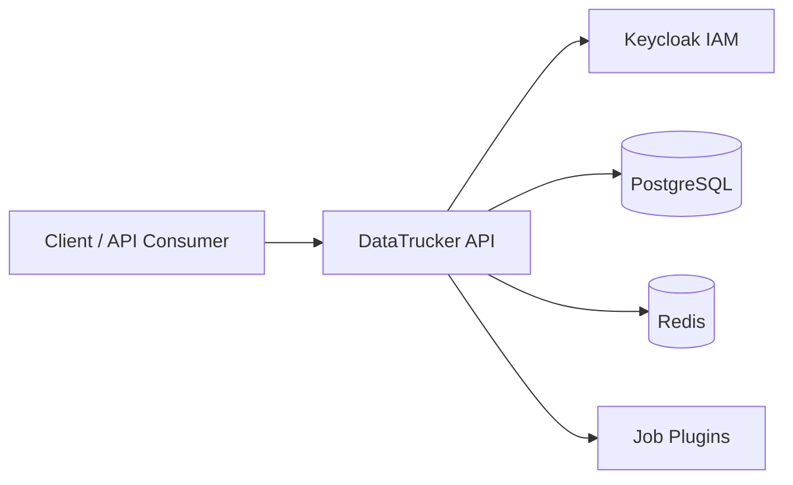

# Ecommerce Inventory Sync — Architecture

## Overview
Multi-warehouse event-driven state synchronization with distributed locking.

## Component Diagram

## Data Flow
1. Client authenticates via Keycloak OAuth2
2. DataTrucker validates JWT and RBAC roles
3. Job pipeline executes declarative workflow
4. Results persisted and/or streamed to downstream systems

## Builder
Gaurav Shankar <gauravshankar.can@gmail.com>
