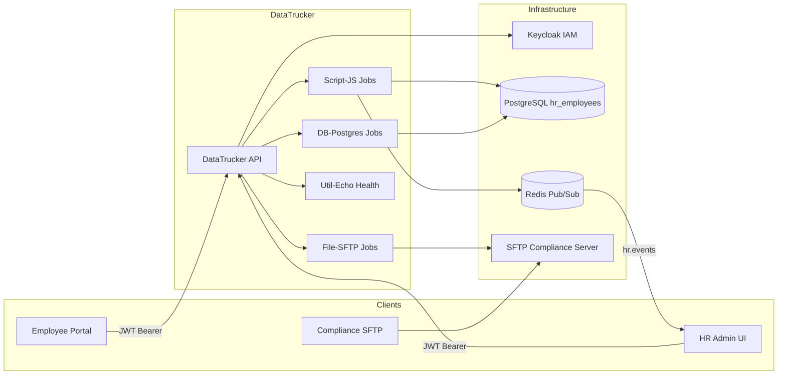

# Employee Management — Architecture

## Overview

The Employee Management mock demonstrates an enterprise HR platform built on DataTrucker. It provides REST APIs for employee lifecycle management (CRUD), department assignment with optimistic locking, and role-based access control enforced through Keycloak.

## Data Flow

## Request Lifecycle

1. **Authentication** — Client obtains an OAuth2 token from Keycloak (`EmployeeManagement` realm).
2. **Authorization** — DataTrucker validates JWT claims against required roles (`hr-admin`, `hr-viewer`, etc.).
3. **Validation** — JSON Schema validations on each JobDefinition reject malformed payloads before execution.
4. **Execution** — Jobs route to the appropriate plugin (DB-Postgres, Script-JS, File-SFTP).
5. **Side Effects** — Create/update operations publish events to Redis channel `hr.events` for downstream consumers.

## Component Breakdown

| Component | Plugin Type | Responsibility |
|-----------|-------------|----------------|
| `healthcheck` | Util-Echo | Platform liveness probe at `/api/v1/statuschecks/healthcheck` |
| `auth-token-introspect` | Script-JS | Derives RBAC permissions from JWT realm roles |
| `list-employees` | DB-Postgres | Paginated employee listing with status/department filters |
| `get-employee` | DB-Postgres | Single employee lookup with manager and department joins |
| `create-employee` | Script-JS | Inserts employee, generates employee number, publishes event |
| `update-employee` | DB-Postgres | Partial update with audit trail columns |
| `delete-employee` | DB-Postgres | Soft delete (sets `deleted_at`, status = `terminated`) |
| `list-departments` | DB-Postgres | Department catalog with active headcount |
| `assign-department` | Script-JS | Department transfer with Redis distributed lock |
| `audit-log-export` | File-SFTP | CSV export of audit records to compliance SFTP |

## RBAC Matrix

| Role | List/Read | Create | Update | Delete | Assign Dept | Audit Export |
|------|-----------|--------|--------|--------|-------------|--------------|
| `hr-admin` | ✓ | ✓ | ✓ | ✓ | ✓ | ✓ |
| `hr-viewer` | ✓ | ✗ | ✗ | ✗ | ✗ | ✗ |
| `hr-manager` | ✓ (team) | ✗ | ✓ (team) | ✗ | ✓ (request) | ✗ |
| `compliance-auditor` | ✓ | ✗ | ✗ | ✗ | ✗ | ✓ |

## Database Schema (Summary)

- **employees** — Core employee records with soft-delete support
- **departments** — Organizational units with cost center codes
- **department_assignments** — Historical transfer log with effective dates
- **employee_audit_log** — Immutable audit trail for compliance

## Event Topics

| Channel | Event | Payload |
|---------|-------|---------|
| `hr.events` | `employee.created` | `{ id, employee_number, department_id }` |
| `hr.events` | `employee.department_changed` | `{ employee_id, from_dept, to_dept }` |

## Security Considerations

- All mutating endpoints require `hr-admin` or scoped client roles.
- Department assignment uses Redis `SET NX EX 30` to prevent concurrent transfer races.
- Soft deletes preserve records for compliance; hard deletes are not exposed via API.
- Audit exports are written to an isolated SFTP account with write-only permissions.
