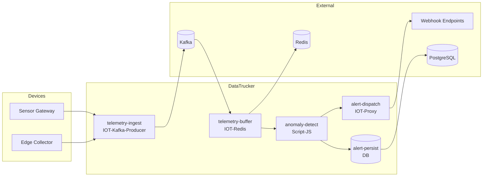

# IoT Telemetry Alerts — Architecture

## Overview

This mock use case demonstrates a production-style IoT telemetry pipeline built on DataTrucker. Devices publish time-series metrics through a Kafka ingestion path. Rolling windows are buffered in Redis for near-real-time aggregation. A JavaScript anomaly-detection job compares incoming values against statistical baselines. When thresholds are breached, alerts are persisted to PostgreSQL and routed to external systems via the IOT-Proxy webhook dispatcher.

## System Context

## Job Pipeline

| Job | Plugin | Method | Responsibility |
|-----|--------|--------|----------------|
| `telemetry-ingest` | IOT-Kafka-Producer | POST | Validate and publish raw device payloads to `iot.telemetry.raw` |
| `telemetry-buffer` | IOT-Redis | POST | Maintain sliding-window aggregates per device/metric |
| `anomaly-detect` | Script-JS | POST | Z-score anomaly scoring against rolling baseline |
| `alert-dispatch` | IOT-Proxy | POST | Route alert payloads to configured webhook URLs |
| `alert-persist` | DB | POST | Store alert lifecycle state (open → acknowledged → resolved) |
| `health-ping` | Util-Echo | GET | Subsystem health echo for synthetic monitoring |

## Data Flow

1. **Ingestion** — Device gateways POST telemetry batches. JSON Schema validation enforces `deviceId`, ISO-8601 `timestamp`, and numeric `metrics` map.
2. **Buffering** — Redis sorted sets keyed by `iot:telemetry:{deviceId}:{metric}:{windowKey}` store recent samples for baseline computation.
3. **Detection** — Script-JS computes z-score: `(value - mean) / stddev`. Values exceeding `thresholdSigma` (default 3σ) generate alerts.
4. **Dispatch** — Critical alerts fan out to PagerDuty/Slack/custom webhooks via IOT-Proxy with retry semantics.
5. **Persistence** — All alerts land in `iot_alerts` table for audit and operator dashboards.

## Security

- Keycloak realm `IoT-Telemetry` with roles: `iot-admin`, `iot-operator`, `iot-viewer`, `webhook-dispatcher`
- Device gateway uses service-account client `iot-device-gateway` (no direct-access grants)
- Webhook URLs validated at schema level; outbound calls use mTLS in production overlays

## Scalability

- Kafka partitions keyed by `deviceId` for ordered per-device processing
- Redis TTL on window keys prevents unbounded memory growth
- API replicas set to 2 in pipeline spec; horizontal scale via DatatruckerFlow `Replicas`

## Observability

- Health endpoint: `GET /api/v1/statuschecks/healthcheck`
- Per-job Util-Echo probes for subsystem isolation
- k6 load tests simulate burst telemetry and sustained anomaly storms

## Failure Modes

| Failure | Mitigation |
|---------|------------|
| Kafka broker down | Ingest returns 503; clients retry with exponential backoff |
| Redis eviction | Baseline recomputed from DB historical aggregates |
| Webhook timeout | Alert remains `open`; dead-letter queue via Kafka `iot.alerts.dlq` |
| Invalid payload | Schema validation rejects with 400 before side effects |
